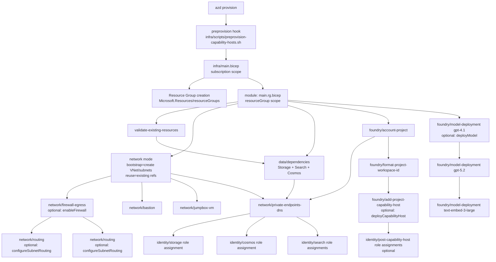

# Architecture Flow (Current)

This is the current end-to-end Bicep deployment flow after the entrypoint changes.



## Key change summary

- `azd` now starts at `infra/main.bicep` (subscription scope).
- `main.bicep` calls `main.rg.bicep` for all resource-group resources.
- Agent subnet in the flow is `snet-agent-host`.

## ASCII Flow (Current)

```text
+------------------+
|   azd provision  |
+------------------+
          |
          v
+-----------------------------------------------+
| preprovision hook                             |
| (capability host cleanup / state reconciliation)
+-----------------------------------------------+
          |
          v
+-----------------------------------------------+
| main.bicep (subscription scope)               |
| - creates target Resource Group               |
| - invokes main.rg.bicep at RG scope           |
+-----------------------------------------------+
          |
          v
+-----------------------------------------------+
| main.rg.bicep (resourceGroup scope)           |
+-----------------------------------------------+
  |                 |              |                    |
  v                 v              v                    v
[validate] [existing network refs] [dependencies] [foundry account+project]
    |                 |              |                    |
    |                 +--------------+--------------------+
    |                                v
    +----------------------> [private endpoints + private DNS]

network mode fan out:
  -> [bootstrap: create vnet/subnets]
  -> [reuse: existing vnet/subnet refs]
  -> [bastion]
  -> [jumpbox-vm]
  -> [firewall-egress] (if enableFirewall=true)
         -> [routing mgmt subnet UDR] (if configureSubnetRouting=true)
         -> [routing agent-host subnet UDR + delegation] (if configureSubnetRouting=true)

foundry account+project
  -> [format workspace id]
  -> [model deploy gpt-4.1] -> [gpt-5.2] -> [text-embed]   (if deployModel=true)
  -> [capability host]                                      (if deployCapabilityHost=true)
       -> [post-capability-host role assignments]           (optional)

private endpoints + DNS
  -> [storage role assignment]
  -> [cosmos role assignment]
  -> [search role assignments]
```
